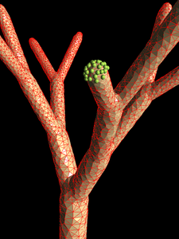

# Meshing Algorithms ([URL](http://galacticbubble.com/mulphys/mesh))

## Author: [Andrei V Smirnov](mailto:andrei.v.smirnov@gmail.com)

## Methods

### [Tool Meshing](http://galacticbubble.com/mulphys/tam/index.html)
### [Monte-Carlo Meshing](http://galacticbubble.com/mulphys/mesh/mc/index.php)
### [Propagating Front Meshing](http://galacticbubble.com/mulphys/mesh/pf/index.html)
### [Curved Surface Meshing](http://galacticbubble.com/mulphys/mesh/surfer/index.html)
### [Space-Time Meshing](http://galacticbubble.com/mulphys/gem/4D/index.html)

## Application: [SURFER](surfer/) - Surface Meshing With MC/PF Algorithms

Produces a triangulated surface mesh from level-set function defined on a rectangular grid.

The algorithm consists of two parts: 

- A node-placement procedure to produce a regular set of nodes on a zero-level surface of the level-set function.
- A triangulation procedure to connect the set of nodes into a triangulated surface.

The node placement procedure uses Monte-Carlo method to place the nodes and is implemented in Fortran.
The surface triangulation procedure uses propagating front method (C++).

## Demos

#### To run the Monte-Carlo meshing demos change to [mc/demo/run](mc/demo/run) directory and run

- appletviewer line.html
- appletviewer square.html
- appletviewer cube.html

#### To run the propagating front meshing demo change to [pf](pf) directory and run

- appletviewer pfmesh.html

